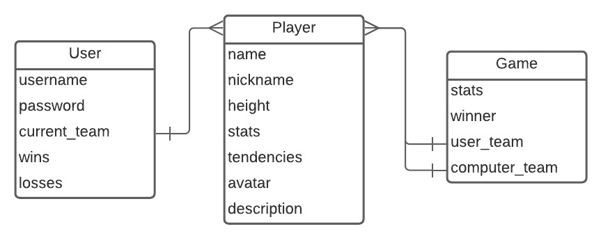
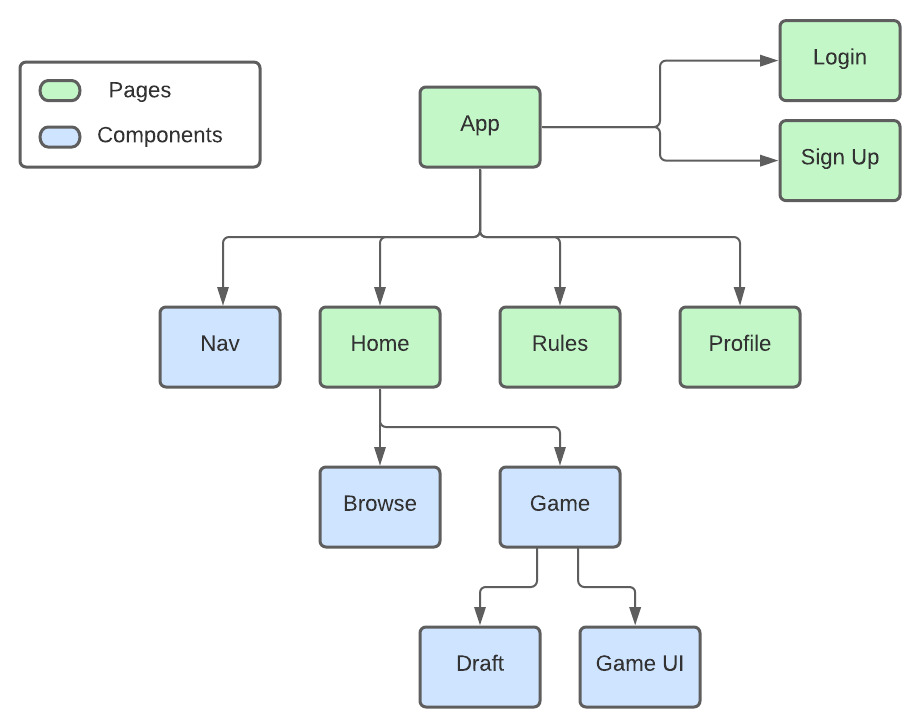
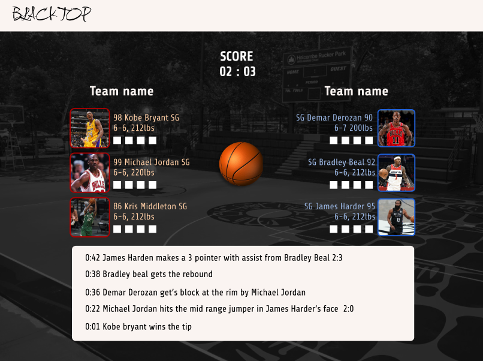
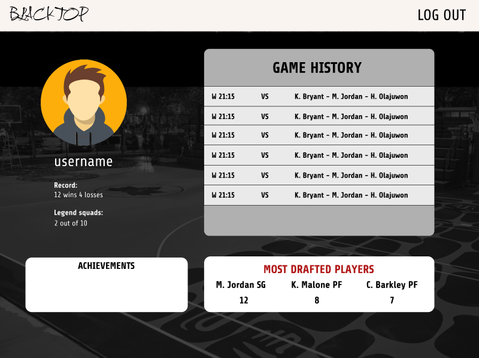

# Blacktop NBA Legends Arena

### By Vladimir Kim

### Blacktop Arena is a 3 vs 3 basketball simulation game
 that allows users to pick their favorite current or historic NBA players to compete in 3 v 3 simulation.
Complex attribute system provides user with unique set of drafted big 3 that copmpetes against computer generated big 3 or legendary nba trios.
This project relies on players and gameplay algorithm that will be created for unique game simulation and game results.
________-
## Back-end
* Django
* Python
* PostgreSQL

## Front-end 
* Vue (Vuex)
___________
## Post MVP features
* Run 5 v 5 simulations
* Participate in tournaments and seasons
* Added complexity with a richer attribute system

## ERD

## Component Hierarchy Diagram

## Concept Design in Figma

## Inspiration

In my project 1 I was able to create a mini fantasy RPG game and I always looked back with hopes of having time to polish it up using new learned skills and frameworks.
Blacktop Capstone project is an upgraded versions of OOP oriented sandbox game with elements of basketball and usage of PSQL database.

## Links

